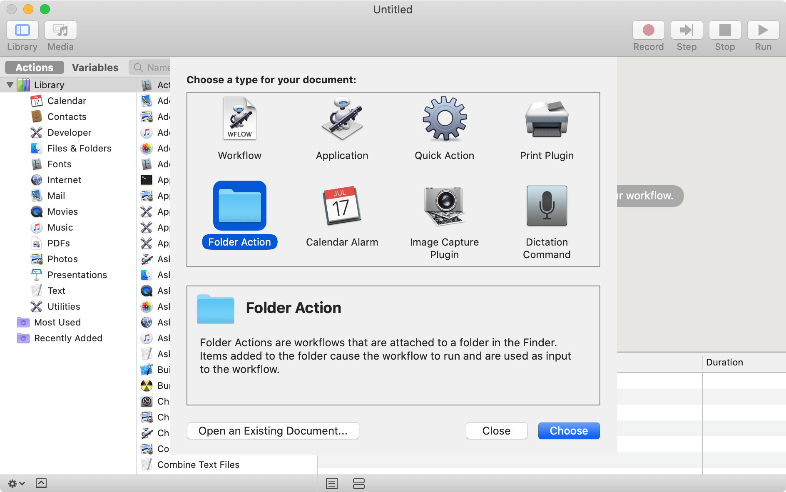

# Automation

The real power of TaskLite gets unlocked when it's set up to
be tightly integrated with other apps.
This section contains several examples of how it can work together
with other systems and services.

---
<!-- toc -->
---


## Folder Actions on macOS

Folder actions are a feature on macOS to execute some code
when files are added to a specific directory.

This can for example be used to import all Email files (`.eml`)
which are saved in a directory.


### Setup

1. Open Automator and create a new Folder Action:

    

1. Specify the directory via the select field at the top

1. Add a "Run Shell Script" block with following bash code:

    ```bash
    set -euo pipefail
    input=$(cat -)
    result=$(/Users/adrian/.local/bin/tasklite import "$input" 2>&1 || true)
    resultNorm=${result//[^a-zA-Z0-9 \/:.]/ }
    osascript -e \
        "display notification \"${resultNorm:0:80}\"
        with title \"Email was imported into TaskLite\""
    ```

1. Save the folder action

    
