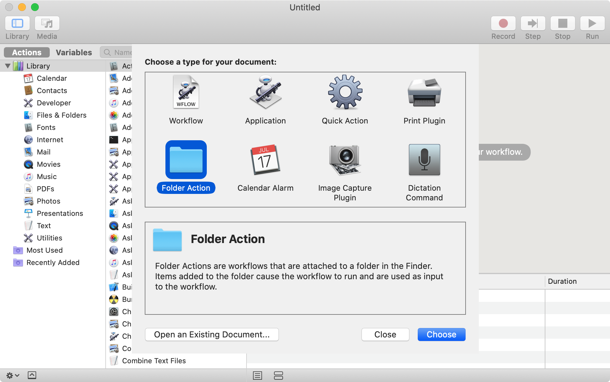

# Automation

The real power of TaskLite gets unlocked when it's set up to
be tightly integrated with other apps.
This section contains several examples of how it can work together
with other systems and services.

---
<!-- toc -->
---


## Folder Actions on macOS

Folder actions are a feature on macOS to execute some code
when files are added to a specific directory.

This can for example be used to import all Email files (`.eml`)
which are saved in a directory.


### Setup

1. Open Automator and create a new Folder Action:

    

1. Specify the directory via the select field at the top

1. Add a "Run Shell Script" block with following bash code:

    ```bash
    set -euo pipefail
    input=$(cat -)
    result=$(/Users/adrian/.local/bin/tasklite import "$input" 2>&1 || true)
    resultNorm=${result//[^a-zA-Z0-9 \/:.]/ }
    osascript -e \
        "display notification \"${resultNorm:0:80}\"
        with title \"Email was imported into TaskLite\""
    ```

1. Save the folder action

    


## Thunderbird Add-On

The [TaskLite Thunderbird add-on](
  https://github.com/ad-si/TaskLite/tree/main/tasklite-thunderbird)
adds an "Add to TaskLite" entry to the context menus
of the message list and of the displayed message.
It imports each selected email like [`tasklite importeml`](
  cli/usage.md#emails).
Importing the same email twice is detected and skipped.

"Add to TaskLite and Edit" additionally opens the task in an editor window
with syntax highlighting,
which uses the same format as `tasklite edit`.
Press <kbd>Cmd</kbd>/<kbd>Ctrl</kbd> + <kbd>Enter</kbd> to save
and <kbd>Esc</kbd> to cancel.

Thunderbird add-ons can't execute programs directly.
Instead, Thunderbird starts `tasklite nativehost run` as a [native messaging]
host and sends it the raw email or the edited task.

[native messaging]:
  https://developer.mozilla.org/en-US/docs/Mozilla/Add-ons/WebExtensions/Native_messaging


### Setup

Requires Thunderbird 140 or later on macOS or Linux.
The add-on isn't published yet,
so it must be built from a clone of the [TaskLite repository],
which requires [Node.js](https://nodejs.org) and npm.
The `nativehost` command isn't part of a release yet either,
so also install TaskLite from the repository with `make install`.

[TaskLite repository]: https://github.com/ad-si/TaskLite

1. Register TaskLite as a native messaging host:

    ```sh
    tasklite nativehost install
    ```

    This writes a launcher script to TaskLite's data directory
    and a manifest pointing to it into Thunderbird's native messaging directory
    (`~/Library/Mozilla/NativeMessagingHosts/` on macOS,
    `~/.mozilla/native-messaging-hosts/` on Linux).
    Run it again if the `tasklite` executable moves.
    If `XDG_CONFIG_HOME` or `XDG_DATA_HOME` are set,
    their values are stored in the launcher,
    so that Thunderbird uses the same database.

1. Build the add-on in the repository's root directory:

    ```sh
    make thunderbird-addon
    ```

1. In Thunderbird, open "Add-ons and Themes",
    click the gear icon, select "Install Add-on From File …",
    and select `tasklite-thunderbird/tasklite.xpi`.


### Troubleshooting

- **"No such native application tasklite"**:
    The native messaging host isn't registered.
    Run `tasklite nativehost install`.
- **Errors after updating TaskLite**:
    Run `tasklite nativehost install` again,
    in case the path of the `tasklite` executable changed.
- **Debugging**:
    Errors of the native messaging host are logged
    to Thunderbird's error console
    (<kbd>Cmd</kbd>/<kbd>Ctrl</kbd> + <kbd>Shift</kbd> + <kbd>J</kbd>).
