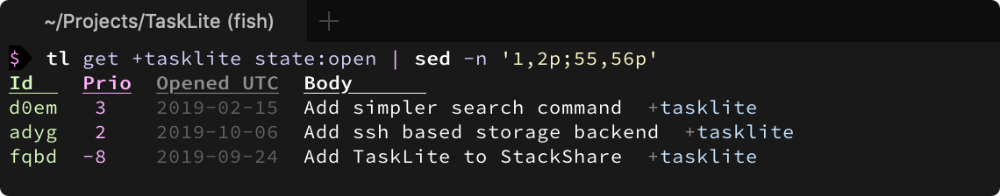

# Concepts

## States

Instead of allowing one to explicitly set a state, TaskLite infers the
current state from several other fields.

There are 2 primary states:

- `Open` - Waits to be done
- `Closed` - Nothing left to be done

And 9 exclusive secondary states.

- `Asleep` - Is hidden because it's not relevant yet
- `Awake` - Has become relevant or will become soon
- `Ready` - Is ready to be done (similar to Open)
- `Waiting` - It's still unclear if the task needs to be done or really has been
    done. Regular checks are necessary until situation clears up.
- `Review` - It's necessary to check if the task can finally be started or
    if it has finally been completed.
- `Done` - Has been done
- `Obsolete` - Has become obsolete or impossible to finish
- `Deletable` - Not needed anymore and can be deleted (item in the trash)
- `Blocked` - Some other task(s) must be done first.
    Blockers are stored in a separate table.

&nbsp;

<small>

State\Field|`awake_utc`|`ready_utc`|`waiting_utc`|`review_utc`|`closed_utc`|`state`
-----------|:---------:|:---------:|:----------:|:---------:|:--------:|:------:
**`Open`**   |   ❔      |    ❔     |   ❔    |    ❔     |  ❌  |    ❌
`└─Asleep`   | > now     |> now or ❌|   ❌    |    ❌     |  ❌  |    ❌
`└─Awake`    | < now     |> now or ❌|   ❌    |    ❌     |  ❌  |    ❌
`└─Ready`    |< now or ❌| < now     |   ❌    |    ❌     |  ❌  |    ❌
`└─Waiting`  |   ❔      |    ❔    |   < now  |> now or ❌|  ❌  |    ❌
`└─Review`   |   ❔      |    ❔    |    ❔    | < now     |  ❌  |    ❌
`└─Blocked`  |   ❔      |    ❔    |    ❔    |    ❔     |  ❌  |    ❌
**`Closed`** |   ❔      |    ❔    |    ❔    |    ❔     |  ✅  |    ❔
`└─Done`     |   ❔      |    ❔    |    ❔    |    ❔     |  ✅  |`Done`
`└─Obsolete` |   ❔      |    ❔    |    ❔    |    ❔     |  ✅  |`Obsolete`
`└─Deletable`|   ❔      |    ❔    |    ❔    |    ❔     |  ✅  |`Deletable`

</small>

Legend:
- ✅ = Set
- ❌ = Not set
- ❔ = Maybe set


Tertiary states:

- `Repeating` - If this task get completed, a duplicate will be created
    with the specified time offset.
    I.e. subsequent tasks get delayed
    (e.g. mowing the lawn)
- `Recurring` - Task which needs to be done every day, week, etc.
    I.e. missed completions must be caught up immediately.
    (e.g. paying rent)
    The number of tasks which will be created in advance
    can be set via a config.
- `Frozen` - Was previously repeating or recurring but has been stopped
    for the time being.


State\Field |`group_ulid`|`repetition_duration`|`recurrence_duration`
------------|------------|---------------------|---------------------
`Repeating` | ✅         | ✅                  | ❌
`Recurring` | ✅         | ❌                  | ✅
`Frozen`    | ✅         | ❌                  | ❌

A task is either recurring or repeating,
but can't be both at the same time.


## Priority

The priority of a task is a decimal number
between negative and positive inifity.
It is automatically calculated based on the age, the due date,
and several other values.



The idea is that you never have to manually set a priority,
because it can be derived accurately from other values.
This of course requires you
to use the other available meta information adequately!

The exact calculation algorithm can be found
in the `taskViewQuery` function in [DbSetup.hs].

[DbSetup.hs]:
    https://github.com/ad-si/TaskLite/blob/master/tasklite-core/source/DbSetup.hs

If you want to adjust the priority of selected tasks manually,
you can use the `tl boost [ulid]` command to increase the priority by 1,
or the `tl hush [ulid]` command to decrease it by 1.


## Notes

A task can have several notes. Each note is identified by an [ULID].

[ULID]: https://github.com/ulid/spec

```txt
$ tl add Buy milk
🆕 Added task "Buy milk" with id "01dpgj8e9ws2dwgvsk5nmrvvg9"

$ tl note 'The vegan one from Super Buy' 01dpgj8e9ws2dwgvsk5nmrvvg9
🗒  Added a note to task "Buy milk" with id "01dpgj8e9ws2dwgvsk5nmrvvg9"

$ tl info 01dpgj8e9ws2dwgvsk5nmrvvg9
awake_utc: null
review_utc: null
state: null
repetition_duration: null
recurrence_duration: null
body: Buy milk
user: adrian
ulid: 01dpgj8e9ws2dwgvsk5nmrvvg9
modified_utc: 2019-10-06 12:59:46
group_ulid: null
closed_utc: null
priority_adjustment: null
metadata: null
waiting_utc: null
ready_utc: null
due_utc: null
priority: 1.0
tags:

notes:
  - note: The vegan one from Super Buy
    ulid: 01dpgjf35pq74gchsgtcd6fgsa
```
