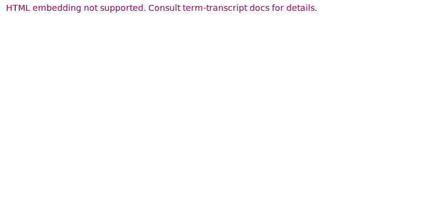
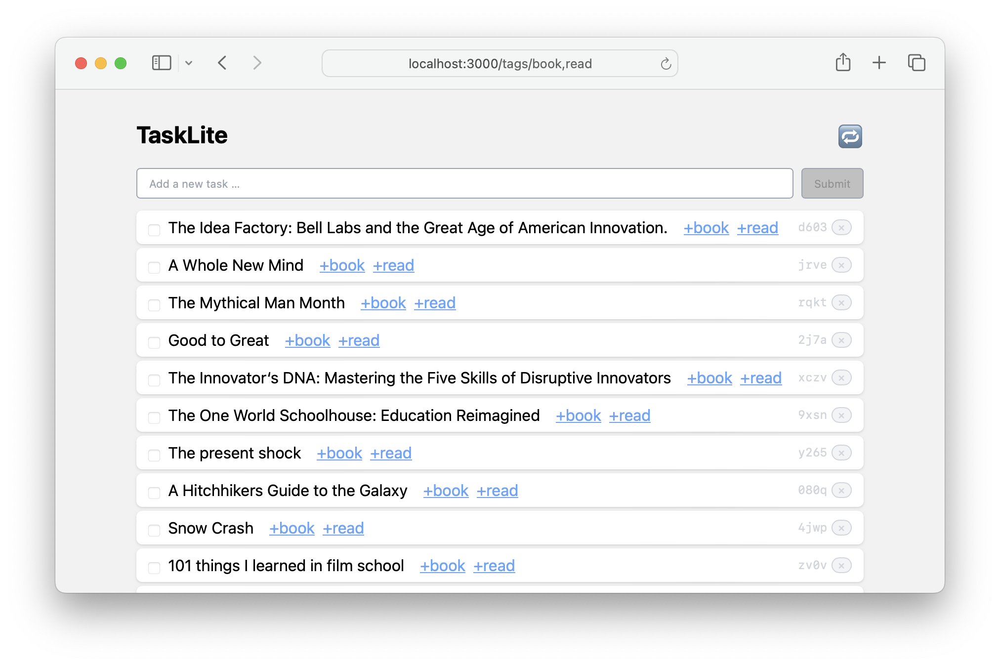

# Introduction

TaskLite is a task manager built with [Haskell] and [SQLite].
It includes a CLI tool, a GraphQL server, and a webapp.

[Haskell]: https://haskell.org
[SQLite]: https://sqlite.org


## CLI



<!--
```txt
$ tl add Buy milk +groceries
🆕 Added task "Buy milk" with id "01dd62xryn5fnzjgynkcy06spb"

$ tl add Go running
🆕 Added task "Go running" with id "01dd62yjtrtmaph23knff6mbsj"

$ tl
Id  Prio  Opened UTC  Body
pb   2    2019-06-12  Buy milk  +groceries
sj   0    2019-06-12  Go running

$ tl do pb
✅ Finished task "Buy milk" with id "01dd62xryn5fnzjgynkcy06spb"
```
-->


## Webapp




## Code

The code is available on [GitHub].

[GitHub]: https://github.com/ad-si/TaskLite


For help and ideas please come visit us at our [GitHub Discussions]!

[GitHub Discussions]: https://github.com/ad-si/TaskLite/discussions


## Latest Versions

- CLI: `{{#include ../tasklite/package.yaml:2}}`
- Webapp: `{{#include ../tasklite-webapp/package.json:3}}`

For all versions and their changes,
check out the [Changelog](/changelog.html).
