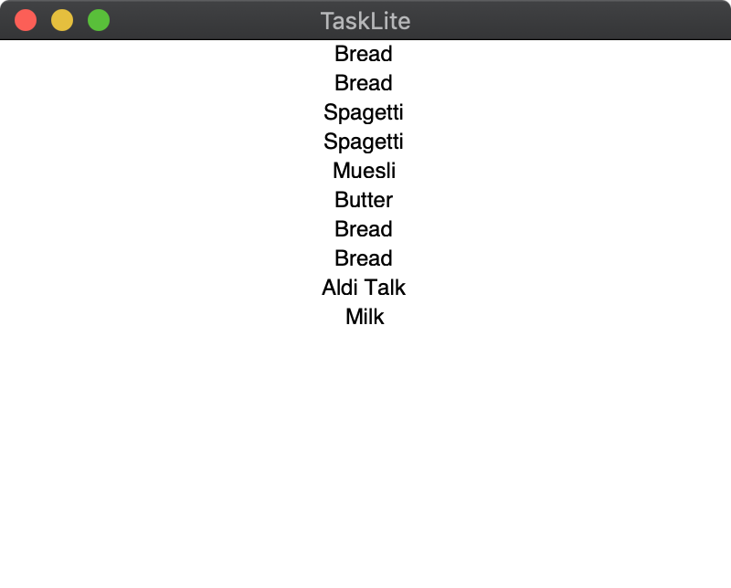

# Desktop App

The desktop app is still very early alpha and can currently only list
the tasks.
It's implemented with a [declarative Haskell wrapper][gi-gtk-declarative]
for GTK.

[gi-gtk-declarative]: https://github.com/owickstrom/gi-gtk-declarative

