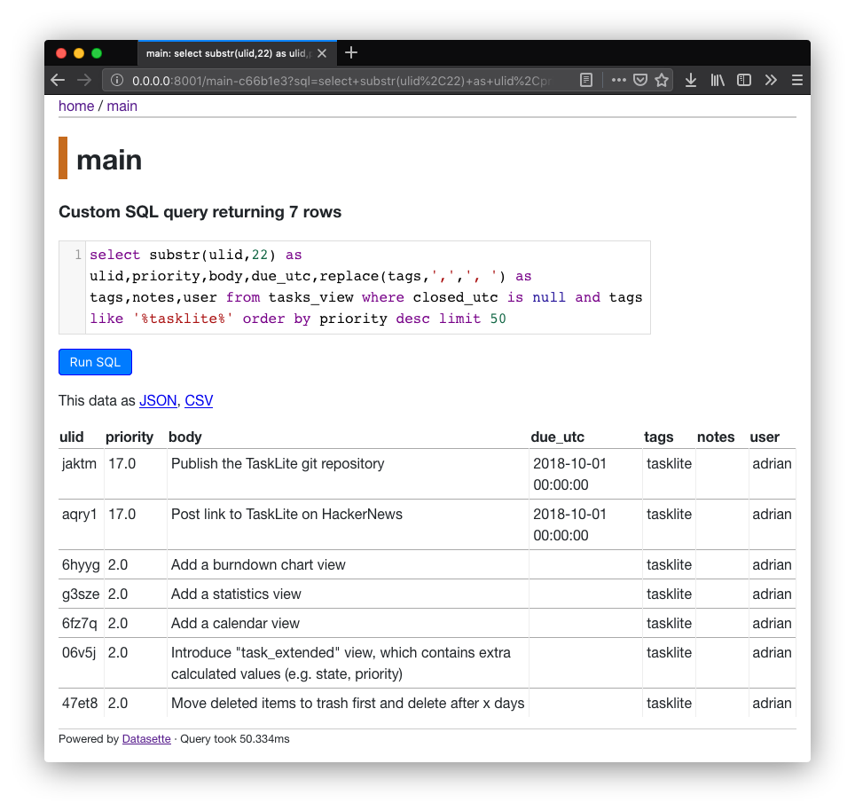

# SQLite Web Frontends

---
<!-- toc -->
---


## Datasette

[Datasette] is an open source multi-tool for exploring and publishing data.
It provides a web frontend for SQLite databases that
can be used to explore your tasks in following way:

[Datasette]: https://github.com/simonw/datasette

```sh
datasette ~/TaskLite/main.db
```

You can then use any of TaskLite's predefined views:
[127.0.0.1:8001/main/tasks_view](
  http://127.0.0.1:8001/main/tasks_view)

Generate custom view by appending the SQL query to the URL.
For example:
[0.0.0.0:8001/main?sql=SELECT+*+FROM+tasks+WHERE+body+LIKE+%27%25xyz%25%27](
  http://0.0.0.0:8001/main?sql=SELECT+*+FROM+tasks+WHERE+body+LIKE+%27%25xyz%25%27
)

You can then bookmark those views for easy access.




## SQLite Web

Another way to host a simple web frontend is
[SQLite Web](https://github.com/coleifer/sqlite-web).

You can run it with Docker like this:

```sh
docker run -it --rm \
  -p 8080:8080 \
  -v ~/TaskLite:/data \
  -e SQLITE_DATABASE=main.db \
  coleifer/sqlite-web
```
