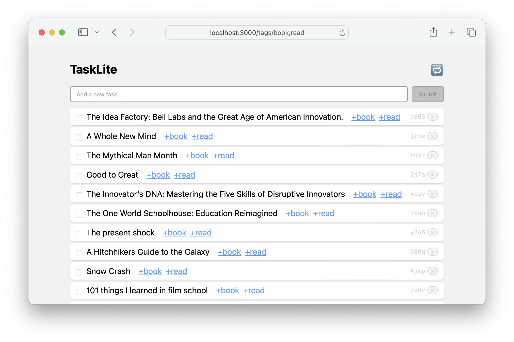

# Web App

---
<!-- toc -->
---

The TaskLite web app is a simple [Elm Land](https://elm.land/) app
backed by an [AirGQL](https://github.com/Airsequel/AirGQL) GraphQL server.




## Usage

### Start the Server

The TaskLite server provides the GraphQL API
and also serves the web app.
First build the web app:

```sh
git clone https://github.com/ad-si/TaskLite
cd TaskLite/tasklite-webapp
make build
```

Then start the server from the root of the repository:

```sh
cd ..
tasklite server
```

The web app will then be available at
[localhost:7458](http://localhost:7458)
and the GraphQL API at
[localhost:7458/graphql](http://localhost:7458/graphql).
The server only accepts connections from the local machine.

The web app is served from `tasklite-webapp/build`
relative to the current working directory.
If the server is started from another directory,
only the API is available.


### Run in the Background on OS Start

The `services` directory contains files to start the server automatically.
They assume that `tasklite` is installed at `~/.local/bin/tasklite`
(the location used by `make install`).
If it is installed somewhere else (check with `command -v tasklite`),
adjust the path in the file.

Run the following commands from the root of the repository
after building the web app as described above.


#### macOS

Install the [LaunchAgent](https://support.apple.com/guide/terminal/apdc6c1077b-5d5d-4d35-9c19-60f2397b2369)
and load it:

```sh
sed \
  -e "s|REPLACE_HOME|$HOME|g" \
  -e "s|REPLACE_REPO_PATH|$PWD|g" \
  services/com.tasklite.server.plist \
  > ~/Library/LaunchAgents/com.tasklite.server.plist

launchctl bootstrap gui/$(id -u) ~/Library/LaunchAgents/com.tasklite.server.plist
```

The server now starts whenever you log in
and is restarted if it crashes.
Logs are written to `~/Library/Logs/tasklite.out.log`
and `~/Library/Logs/tasklite.err.log`.

To restart it (e.g. after installing a new version of TaskLite):

```sh
launchctl kickstart -k gui/$(id -u)/com.tasklite.server
```

To stop it and disable the automatic start:

```sh
launchctl bootout gui/$(id -u)/com.tasklite.server
rm ~/Library/LaunchAgents/com.tasklite.server.plist
```


#### Linux

Install the [systemd](https://systemd.io) user service and enable it:

```sh
mkdir -p ~/.config/systemd/user

sed "s|REPLACE_REPO_PATH|$PWD|g" \
  services/tasklite-server.service \
  > ~/.config/systemd/user/tasklite-server.service

systemctl --user daemon-reload
systemctl --user enable --now tasklite-server
```

The server now starts whenever you log in
and is restarted if it crashes.
To start it at boot, even before you log in,
run `loginctl enable-linger`.

Show the logs with `journalctl --user --unit tasklite-server`.

To restart it (e.g. after installing a new version of TaskLite):

```sh
systemctl --user restart tasklite-server
```

To stop it and disable the automatic start:

```sh
systemctl --user disable --now tasklite-server
rm ~/.config/systemd/user/tasklite-server.service
```


### Development

To work on the web app, start the development server
while the TaskLite server is running:

```sh
cd tasklite-webapp
make start
```

The development version will then be available at
[localhost:7459](http://localhost:7459).


## Dashboard

A simple way to create a dashboard with multiple views
is to create an HTML file with multiple iframes that load the different views.

```html
<!DOCTYPE html>
<html>
<head>
  <meta charset="utf-8">
  <meta name="viewport" content="width=device-width, initial-scale=1">
  <title>TaskLite Dashboard</title>
  <link
    rel="icon"
    type="image/png"
    href="https://raw.githubusercontent.com/ad-si/TaskLite/master/docs-source/images/icon.png"
  >
  <style type="text/css">
    * { margin: 0; padding: 0; border: 0; box-sizing: border-box; }
    html { height: 100%; }
    body { height: 100%; font-family: sans-serif; }
    header { padding: 0.5rem; }
    iframe { width: 100%; height: 100%; }
    #grid {
      display: grid;
      grid-template-columns: 1fr 1fr;
      grid-template-rows: 1fr 1fr;
      height: 100%;
    }
  </style>
</head>
<body>
  <div id="grid">
    <iframe src="http://localhost:7458/tags/focus"></iframe>
    <iframe src="http://localhost:7458/tags/chore"></iframe>
    <iframe src="http://localhost:7458/tags/buy"></iframe>
    <iframe src="http://localhost:7458/tags/work"></iframe>
  </div>
</body>
</html>
```
