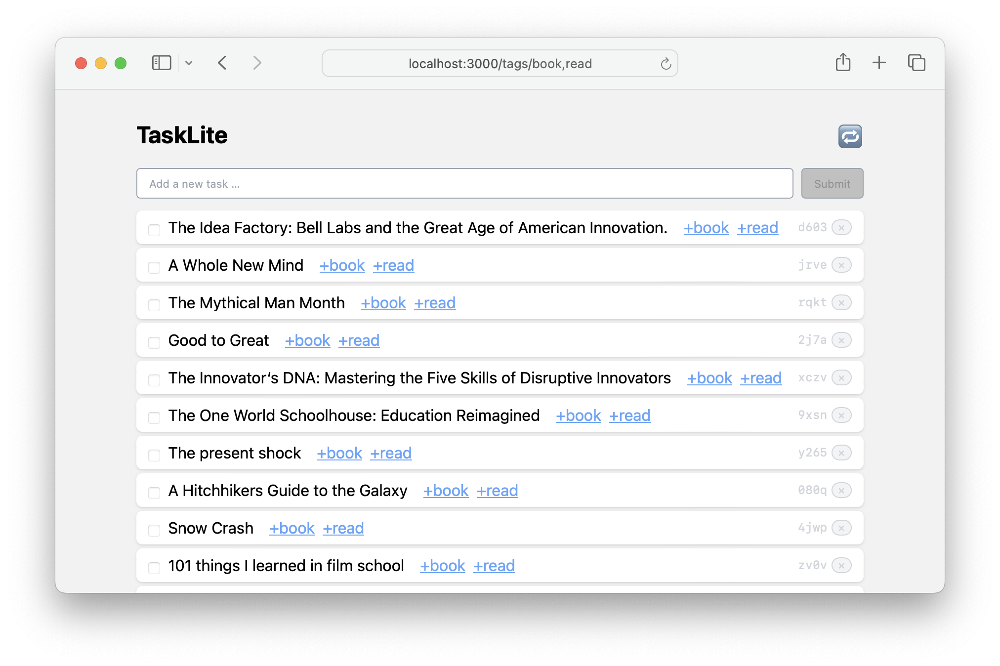

# Web App

---
<!-- toc -->
---

The TaskLite web app is a simple [Elm Land](https://elm.land/) app
backed by an [AirGQL](https://github.com/Airsequel/AirGQL) GraphQL server.




## Usage

### Start the Server

To use it you first need to start the server:

```sh
tasklite server
```

Then you need to start the web app server:

```sh
git clone https://github.com/ad-si/TaskLite
cd TaskLite/tasklite-webapp
make start
```

The web app will then be available at
[localhost:3000](http://localhost:3000).


## Dashboard

A simple way to create a dashboard with multiple views
is to create a HTML file with multiple iframes that load the different views.

```html
<!DOCTYPE html>
<html>
<head>
  <meta charset="utf-8">
  <meta name="viewport" content="width=device-width, initial-scale=1">
  <title>TaskLite Dashboard</title>
  <link
    rel="icon"
    type="image/png"
    href="https://raw.githubusercontent.com/ad-si/TaskLite/master/docs-source/images/icon.png"
  >
  <style type="text/css">
    * { margin: 0; padding: 0; border: 0; box-sizing: border-box; }
    html { height: 100%; }
    body { height: 100%; font-family: sans-serif; }
    header { padding: 0.5rem; }
    iframe { width: 100%; height: 100%; }
    #grid {
      display: grid;
      grid-template-columns: 1fr 1fr;
      grid-template-rows: 1fr 1fr;
      height: 100%;
    }
  </style>
</head>
<body>
  <div id="grid">
    <iframe src="http://localhost:3000/tags/focus"></iframe>
    <iframe src="http://localhost:3000/tags/chore"></iframe>
    <iframe src="http://localhost:3000/tags/buy"></iframe>
    <iframe src="http://localhost:3000/tags/work"></iframe>
  </div>
</body>
</html>
```
