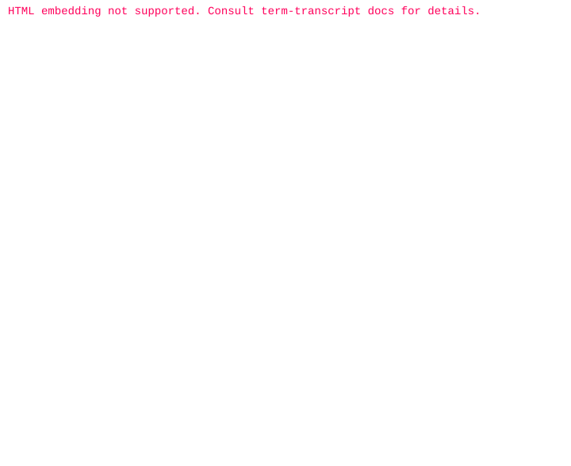

[][TaskLite]

[TaskLite]: https://tasklite.org

# TaskLite

CLI task manager built with [Haskell] and [SQLite].

[Haskell]: https://www.haskell.org/
[SQLite]: https://www.sqlite.org/

## [Documentation][TaskLite]

## Community

Everyone participating in the TaskLite community
is expected to follow our [Code of Conduct](./code_of_conduct.md).

## License

TaskLite is free and open source software, licensed under the [AGPL-3.0](./license).

---

This site is powered by [Netlify](https://www.netlify.com).
