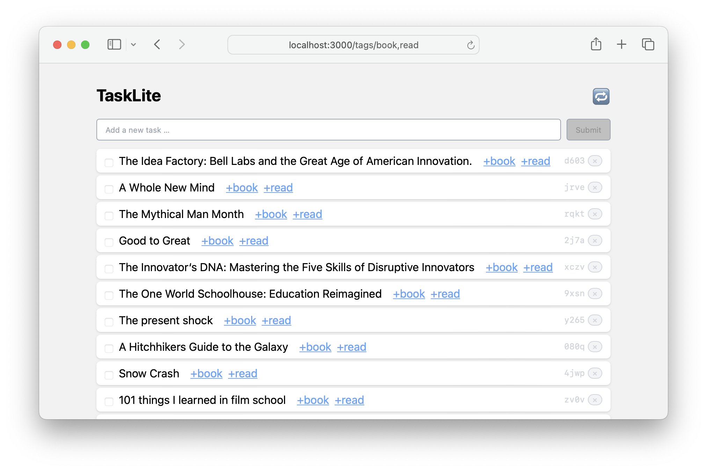

# TaskLite Web App

The TaskLite web app is a simple [Elm Land](https://elm.land/) app
backed by an [AirGQL](https://github.com/Airsequel/AirGQL) GraphQL server.




## Development

1. Install dependencies with `npm install`.
1. Build GraphQL connector code:
    ```sh
    npx elm-graphql --skip-elm-format \
      http://localhost:7458/graphql
    ```
1. Start the development server by running:
    ```sh
    npx elm reactor
    ```

You can now access the app at <localhost:8000/src/>.
